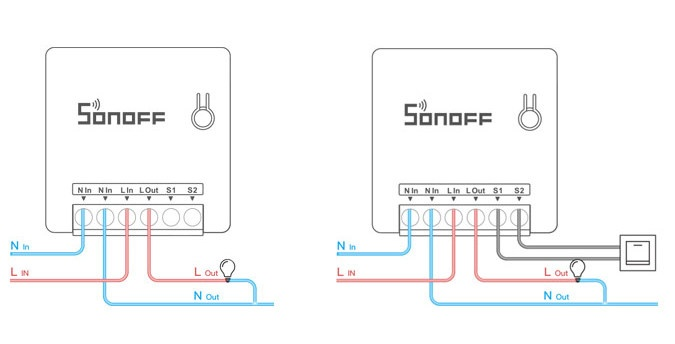
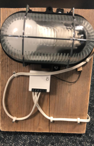
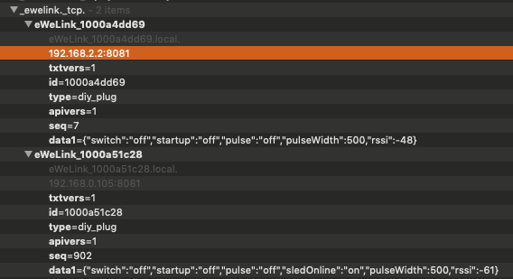

# Configure-Sonoff-mini-DIY-mode-using-mac
Configure your Sonoff mini DIY using a Apple mac

in this small tutorial we will install a Sonoff in DIY mode so we do not use the china servers.
Connect your sonoff using the following diagram



Plugin the Sonoff switch with as an example a light to it, it looks simmilar to the following.



Please connect your apple macbook to the internet by cable, go to internet sharing and share your Ethernet over Wifi. Create a wifi network as following:

```
WiFi SSID: sonoffDiy
password: 20170618sn
```
After you are connected use the Discovery browser (before bonjour browser) and check something that looks like eWelink




Or insert the following at your terminal:
```
<Computername>:~ ><Username>$ dns-sd -B _ewelink._tcp

Browsing for _ewelink._tcp
DATE: ---Thu 28 Nov 2019---
 9:36:38.408  ...STARTING...
Timestamp     A/R    Flags  if Domain               Service Type         Instance Name
 9:36:38.409  Add        2  15 local.               _ewelink._tcp.       eWeLink_1000axxxxx
 9:36:38.734  Add        2   5 local.               _ewelink._tcp.       eWeLink_1000axxxxx
 9:36:38.998  Add        2  14 local.               _ewelink._tcp.       eWeLink_1000axxxxx
```

All of the details you need:
```
device1 - 1000axxxxx - 192.168.2.2 <connected to the DIY wifi>
device2 - 1000axxxxx - 192.168.0.105 <Connected to my network>
```

Then use the following command in your terminal to test if everything works as expected in your test wifi network:
```
#light on/off

on
curl -XPOST "http://<Ip-add>:8081/zeroconf/switch" -d '{"deviceid":"1000axxxxx","data":{"switch":"on"}}'

off
curl -XPOST "http://<Ip-add>:8081/zeroconf/switch" -d '{"deviceid":"1000axxxxx","data":{"switch":"off"}}'
```

You can add the Sonoff Mini to your existing network by using the following command:

```
curl -XPOST "http://<Ip-add>:8081/zeroconf/wifi" -d '{"deviceid":"1000axxxxx","data":{"ssid": "<Wifi network name>","password": "<Wifi Password>"}}'
```

Now test your Sonoff Mini after you connect it to your own home network. In my case it took some time before it appeared in Discovery. Eventually check your IP in your Router/Firewall with the name ESP_8xxxxx

```
#light on/off

on
curl -XPOST "http://<Ip-add>:8081/zeroconf/switch" -d '{"deviceid":"1000axxxxx","data":{"switch":"on"}}'

off
curl -XPOST "http://<Ip-add>:8081/zeroconf/switch" -d '{"deviceid":"1000axxxxx","data":{"switch":"off"}}'
```

Now you can use some python scripts to talk to your light or implement it in homebridge
